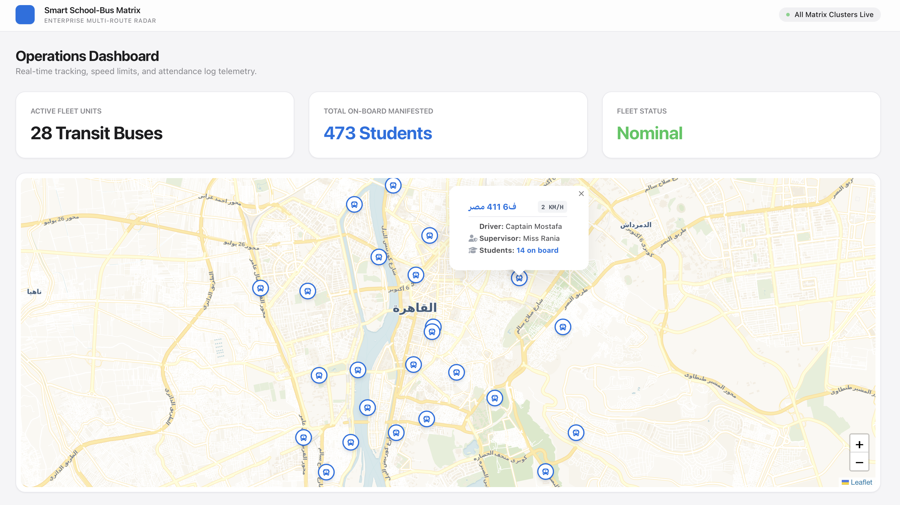

# 🚌 Smart School-Bus Matrix
> An elegant, real-time student transit safety control room inspired by **Apple Design Language**. Built using Laravel 13, Node.js, Socket.io, and Leaflet maps.

---

## 📱 Interface Preview

Here is a live look at the production-ready operations radar panel:

<p align="center">
  
</p>

### 🌟 Key Visual Features:
* **Apple UI/UX:** Clean aesthetics using light gray tones (`#f5f5f7`), sharp typography, and glassmorphism.
* **Live Fleet Indicators:** Smooth pulsing blue markers (`animate-ping`) simulating actual iOS location nodes.

---

## 🛠️ Tech Stack & Architecture

* **Backend Matrix:** Laravel & PHP 
* **Telemetry Gateway Server:** Node.js v26 & Express
* **Real-time Pipeline:** Socket.io (Running on Core Port `6002`)
* **Geographic Map Canvas:** Leaflet.js with Voyager Light theme

---

## 🚀 Quick Start & Telemetry Deployment

### 1. Telemetry Gateway (Node.js)
```bash
cd tracking-gateway
node server.js
